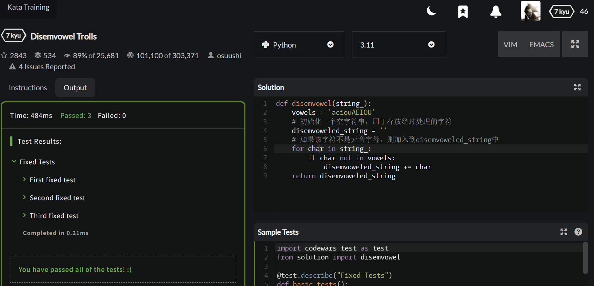

# 实验三 Python列表

班级： 21计科02

学号： B20210302232

姓名： 闫新宇

Github地址：<https://github.com/yanxinyvvv/sythree.git>

CodeWars地址：<https://www.codewars.com/users/闫新宇>

---

## 实验目的

1. 学习Python的简单使用和列表操作
2. 学习Python中的if语句

## 实验环境

1. Git
2. Python 3.10
3. VSCode
4. VSCode插件

## 实验内容和步骤

### 第一部分

Python列表操作

完成教材《Python编程从入门到实践》下列章节的练习：

- 第3章 列表简介
- 第4章 操作列表
- 第5章 if语句

---

### 第二部分

在[Codewars网站](https://www.codewars.com)注册账号，完成下列Kata挑战：

---

#### 第一题：3和5的倍数（Multiples of 3 or 5）

难度： 6kyu

如果我们列出所有低于 10 的 3 或 5 倍数的自然数，我们得到 3、5、6 和 9。这些数的总和为 23. 完成一个函数，使其返回小于某个整数的所有是3 或 5 的倍数的数的总和。此外，如果数字为负数，则返回 0。

注意：如果一个数同时是3和5的倍数，应该只被算一次。

**提示：首先使用列表解析得到一个列表，元素全部是3或者5的倍数。
使用sum函数可以获取这个列表所有元素的和.**

代码提交地址：
<https://www.codewars.com/kata/514b92a657cdc65150000006>

---

#### 第二题： 重复字符的编码器（Duplicate Encoder）

难度： 6kyu

本练习的目的是将一个字符串转换为一个新的字符串，如果新字符串中的每个字符在原字符串中只出现一次，则为"("，如果该字符在原字符串中出现多次，则为")"。在判断一个字符是否是重复的时候，请忽略大写字母。

例如:

```python
"din"      =>  "((("
"recede"   =>  "()()()"
"Success"  =>  ")())())"
"(( @"     =>  "))(("
```

代码提交地址:
<https://www.codewars.com/kata/54b42f9314d9229fd6000d9c>

---

#### 第三题：括号匹配（Valid Braces）

难度：6kyu

写一个函数，接收一串括号，并确定括号的顺序是否有效。如果字符串是有效的，它应该返回True，如果是无效的，它应该返回False。
例如：

```python
"(){}[]" => True 
"([{}])" => True
 "(}" => False
 "[(])" => False 
"[({})](]" => False
```

**提示：
python中没有内置堆栈数据结构，可以直接使用`list`来作为堆栈，其中`append`方法用于入栈，`pop`方法可以出栈。**

代码提交地址
<https://www.codewars.com/kata/5277c8a221e209d3f6000b56>

---

#### 第四题： 从随机三元组中恢复秘密字符串(Recover a secret string from random triplets)

难度： 4kyu

有一个不为你所知的秘密字符串。给出一个随机三个字母的组合的集合，恢复原来的字符串。

这里的三个字母的组合被定义为三个字母的序列，每个字母在给定的字符串中出现在下一个字母之前。"whi "是字符串 "whatisup "的一个三个字母的组合。

作为一种简化，你可以假设没有一个字母在秘密字符串中出现超过一次。

对于给你的三个字母的组合，除了它们是有效的三个字母的组合以及它们包含足够的信息来推导出原始字符串之外，你可以不做任何假设。特别是，这意味着秘密字符串永远不会包含不出现在给你的三个字母的组合中的字母。

测试用例：

```python
secret = "whatisup"
triplets = [
  ['t','u','p'],
  ['w','h','i'],
  ['t','s','u'],
  ['a','t','s'],
  ['h','a','p'],
  ['t','i','s'],
  ['w','h','s']
]
test.assert_equals(recoverSecret(triplets), secret)
```

代码提交地址：
<https://www.codewars.com/kata/53f40dff5f9d31b813000774/train/python>

提示：

- 利用集合去掉`triplets`中的重复字母，得到字母集合`letters`，最后的`secret`应该由集合中的字母组成，`secret`长度也等于该集合。

```python
letters = {letter for triplet in triplets for letter in triplet }
length = len(letters)
```

- 创建函数`check_first_letter(triplets, first_letter)`，检测一个字母是不是secret的首字母，返回True或者False。
- 创建函数`remove_first_letter(triplets, first_letter)`,  从三元组中去掉首字母，返回新的三元组。
- 遍历字母集合letters，利用上面2个函数得到最后的结果`secret`。

---

#### 第五题： 去掉喷子的元音（Disemvowel Trolls）

难度： 7kyu

喷子正在攻击你的评论区!
处理这种情况的一个常见方法是删除喷子评论中的所有元音(字母：a,e,i,o,u)，以消除威胁。
你的任务是写一个函数，接收一个字符串并返回一个去除所有元音的新字符串。
例如，字符串 "This website is for losers LOL!"   将变成 "Ths wbst s fr lsrs LL!".

注意：对于这个Kata来说，y不被认为是元音。
代码提交地址：
<https://www.codewars.com/kata/52fba66badcd10859f00097e>

提示：

- 首先使用列表解析得到一个列表，列表中所有不是元音的字母。
- 使用字符串的join方法连结列表中所有的字母，例如：

```python
last_name = "lovelace"
letters = [letter for letter in last_name ]
print(letters) # ['l', 'o', 'v', 'e', 'l', 'a', 'c', 'e']
name = ''.join(letters) # name = "lovelace"
```

---

### 第三部分

使用Mermaid绘制程序流程图

安装VSCode插件：

- Markdown Preview Mermaid Support
- Mermaid Markdown Syntax Highlighting

使用Markdown语法绘制你的程序绘制程序流程图（至少一个），Markdown代码如下：


显示效果如下：


查看Mermaid流程图语法-->[点击这里](https://mermaid.js.org/syntax/flowchart.html)

使用Markdown编辑器（例如VScode）编写本次实验的实验报告，包括[实验过程与结果](#实验过程与结果)、[实验考查](#实验考查)和[实验总结](#实验总结)，并将其导出为 **PDF格式** 来提交。

## 实验过程与结果

### 第一部分 Python列表操作和if语句

**练习3.1：** 姓名：将一些朋友的姓名存储在一个列表中，并将其命名为
names。依次访问该列表中的每个元素，从而将每个朋友的姓名都打印出来。
```python
names = ['张三','李四','王五','赵六']
print(names[0])
print(names[1])
print(names[2])
print(names[3])
```

**练习3.2：** 问候语：继续使用练习3-1中的列表，但不打印每个朋友的姓名，而为每人打印一条消息。每条消息都包含相同的问候语，但抬头为相应朋友的姓名.
```python
message = "Good morning,"
print(message+names[0])
print(message+names[1])
print(message+names[2])
print(message+names[3])
```

**练习3.3：** 自己的列表：想想你喜欢的通勤方式，如骑摩托车或开汽车，并创建一个包含多种通勤方式的列表。根据该列表打印一系列有关这些通勤方式的陈述，如下所示"I would like to own a Honda motorcycle”。
```python
jt=['bicycle','car','underground','waiking']
s="I would like to own a "
print(sth+ty[0])
print(sth+ty[1])
print(sth+ty[2])
print(sth+ty[3])
```

**练习3.4：** 嘉宾名单：如果你可以邀请任何人一起共进晚餐（无论是在世的还是故去的），你会邀请哪些人？请创建一个列表，其中包含至少三个你想邀请的人；然后使用这个列表打印消息，邀请这些人来与你共进晚餐。
```python
person = ['张三','李四','王五','赵六']
print("welcome to my party "+person[0])
print("welcome to my party "+person[1])
print("welcome to my party "+person[2])
print("welcome to my party "+person[3])
```

**练习3.5：** 修改嘉宾名单：你刚得知有位嘉宾无法赴约，因此需要另外邀请一位嘉宾。①以完成练习3.4时编写的程序为基础，在程序末尾添加函数print()，指出哪位嘉宾无法赴约。②修改嘉宾名单，将无法赴约的嘉宾的姓名替换为新邀请的嘉宾的姓名。③再次打印一系列消息，向名单中的每位嘉宾发出邀请
```python
print(person[2]+" not go to party");
person[2]="张三"
print("welcome to my party "+person[0])
print("welcome to my party "+person[1])
print("welcome to my party "+person[2])
print("welcome to my party "+person[3])
```

**练习3.6：** 添加嘉宾：你刚找到了一个更大的餐桌，可容纳更多的嘉宾就座。请想想你还想邀请哪三位嘉宾。以完成练习3.4或练习3.5时编写的程序为基础，在程序末尾添加函数调用print()语句，指出你找到了一个更大的餐桌。①使用insert()将一位新嘉宾添加到名单开头②使用insert()将另一位新嘉宾添加到名单中间。③使用append()将最后一位新嘉宾添加到名单末尾。④打印一系列消息，向名单中的每位嘉宾发出邀请。
```python
print("I find a big dining-table")
person.insert(0,'张三')
person.insert(2,'李四')
person.append('王五')
print("welcome to my party "+person[0])
print("welcome to my party "+person[1])
print("welcome to my party "+person[2])
print("welcome to my party "+person[3])
print("welcome to my party "+person[4])
print("welcome to my party "+person[5])
print("welcome to my party "+person[6])
```

**练习3.7：** 缩减名单：你刚得知新购买的餐桌无法及时送达，因此只能邀请两位嘉宾。①以完成练习3.6时编写的程序为基础，在程序末尾添加一行代码，打印一条你只能邀请两位嘉宾共进晚餐的消息。②使用pop()不断地删除名单中的嘉宾，直到只有两位嘉宾为止。每次从名单中弹出一位嘉宾时，都打印一条消息，让该嘉宾知道你很抱歉，无法邀请他来共进晚餐。③对于余下两位嘉宾中的每一位，都打印一条消息，指出他依然在受邀人之列。④使用del将最后两位嘉宾从名单中删除，让名单变成空的。打印该名单，核实名单在程序结束时名单确实是空的。
```python
print("I am sorry,I just invite two people")
print("sorry I can't invite you,"+person.pop())
print("sorry I can't invite you,"+person.pop())
print("sorry I can't invite you,"+person.pop())
print("sorry I can't invite you,"+person.pop())
print("sorry I can't invite you,"+person.pop())
print("welcome to my party "+person[0])
print("welcome to my party "+person[1])
del person
```

**练习3.8：** 放眼世界：想出至少5个你想去旅游的地方。①将这些地方存储在一个列表中，并确保其中的元素不是按字母顺序排列的。②按原始排列顺序打印该列表。不要考虑输出是否整洁，只管打印原始Python列表就好。③使用sorted()按字母顺序打印这个列表，不要修改它。④再次打印该列表，核实排列顺序未变。⑤使用sorted()按与字母顺序相反的顺序打印这个列表，不要修改它。⑥再次打印该列表，核实排列顺序未变。⑦使用reverse()修改列表元素的排列顺序。打印该列表，核实排列顺序确实变了。⑧使用reverse()再次修改列表元素的排列顺序。打印该列表，核实已恢复到原来的排列顺序。⑨使用sort()修改该列表，使其元素按字母顺序排列。打印该列表，核实排列顺序确实变了。⑩使用sort()修改该列表，使其元素按与字母顺序相反的顺序排列。打印该列表，核实排列顺序确实变了。
```python
travel = ['长沙','武汉','杭州','北京','上海']
print(travel)
print(sorted(travel))
print(travel)
print(sorted(travel,reverse=True))
print(travel)
travel.reverse()
print(travel)
travel.reverse()
print(travel)
travel.sort()
print(travel)
travel.sort(reverse=True)
print(travel)
```

**练习3.9：** 晚餐嘉宾：选择你为完成练习3.4~练习3.7而编写的程序一个程序，在其中使用len()打印一条消息，指出你邀请了多少位嘉宾来与你共进晚餐。
```python
print(len(person))
```

**练习3.10：** 尝试使用各个函数：想想可存储到列表中的东西，如山川、河流、国家、城市、语言或你喜欢的任何东西。编写一个程序，在其中创建一个包含这些元素的列表。然后，至少把本章介绍的每个函数都使用一次来处理这个列表。
```python
like = ['长白山','黄河','北京','汉语']
print(like)
print(sorted(like))
like.sort(reverse=True)
print(like)
like.insert(2,'开车')
like.append('紫色')
del like[2]
print(like)
like.pop()
print(like)
```

**练习3.11：** 有意引发错误：如果你还没有在程序中遇到索引错误，就尝试引发一个这种错误吧。在你的一个程序中修改索引，以引发索引错误。在关闭程序前，务必消除这种错误。
```python
error = ['sd','s1']
print(error[2])
```

**练习4.1：** 比萨：想出至少三种你喜欢的比萨，将其名称存储在一个列表中，再使用for循环将每种比萨的名称都打印出来。①修改这个for循环，使其打印包含比萨名称的句子，而不仅仅是比萨的名称。对于每种比萨，都显示一行输出，如“I like pepperoni pizza”。②在程序末尾添加一行代码（不在for循环中），指出你有多喜欢比萨。输出应包含针对每种比萨的消息，还有一个总结性的句子，如下所示“I really love pizza!”。
```python
pizzas = ['p1','p2','p3']
for pizza in pizzas:
    print("I like "+pizza+" pizzas")
print("I really love pizza!")
```

**练习4.2：** 动物：想出至少三种有共同特征的动物，将其名称存储在一个列表中，再使用for循环将每种动物的名称打印出来。①修改这个程序，使其针对每种动物都打印一个句子，如下所示“A dog would make a great pet”。②在程序末尾添加一行代码，指出这些动物的共同之处，如打印下面这样的句子“Any of these animals would make a great pet!”。
```python
animals = ['cat','dog','rabbit']
for animal in animals:
    print("A "+animal+" would make a great pet")
print("any of these animals would make a great pet!")
```

**练习4.3：** 数到20：使用一个for循环打印数1~20（含）。
```python
values=list(range(1,21))
for value in values:
    print(value)
```

**练习4.4：** 一百万：创建一个包含数1~1 000 000的列表，再使用一个for循环将这些数打印出来。（如果输出的时间太长，按Ctrl + C停止输出，或关闭输出窗口。）
```python
values=list(range(1,1000001))
for value in values:
    print(value)
```

**练习4.5：** 一百万总和：创建一个包含数1~1 000 000，再使用min()和max()核实该列表确实是从1开始，到1 000 000结束的。另外，对这个列表调用函数sum()，看看Python将100万个数相加需要多长时间。
```python
values=list(range(1,1000001))
for value in values:
    print(value)
print(min(values))
print(max(values))
print(sum(values))
```

**练习4.6：** 奇数：通过给range()函数指定第三个参数来创建一个列表，其中包含1~20的奇数；再使用一个for循环将这些数打印出来。
```python
values=list(range(1,20,2))
for value in values:
    print(value)
```

**练习4.7：** 3的倍数：创建一个列表，其中包含3~30内能被3整除的数字，再使用一个for循环将这个列表中的数打印出来。
```python
values=list(range(3,31,3))
for value in values:
    print(value)
```

**练习4.8：** 立方：将同一个数字乘三次称为立方。例如，在Python中，
2的立方用2**3表示。创建一个列表，其中包含前10个整数（即1~10）的立方，再使用一个for循环将这些立方数打印出来。
```python
sq=[]
for value in range(1,11):
    value=value**3
    sq.append(value)
print(sq)
```

**练习4.9：** 立方推导式：使用列表推导式生成一个列表，其中包含前10个整数的立方。
```python
sq = [value**3 for value in range(1,11)]
print(sq)
```

**练习4.10：** 切片：选择你在本章编写的一个程序，在末尾添加几行代码，以完成如下任务。①打印消息“The first three items in the list are:”，再使用切片来打印列表的前三个元素。②打印消息“Three items from the middle of the list are:”，再使用切片来打印列表中间的三个元素。③打印消息“The last three items in the list are:”，再使用切片来打印列表末尾的三个元素。
```python
fruit = ['apple','banana','peach','orange','watermalon']
print("The first three items in the list are:")
print(fruit[0:3])
print("three items from the middle of the list are:")
print(fruit[1:4])
print("The last three items in the list are:")
print(fruit[2:5])
```

**练习4.11：** 你的比萨和我的比萨：在你为练习4.1而编写的程序中，创建比萨列表的副本，并将赋给变量friend_pizzas中，再完成如下任务。①在原来的比萨列表中添加一种比萨。②在列表friend_pizzas中添加另一种比萨。③核实你有两个不同的列表。为此，打印消息“My favorite pizzas are:”，再使用一个for循环来打印第一个列表；打印消息“My friend’s favorite pizzas are:”，再使用一个for循环来打印第二个列表。核实新增的比萨被添加到了正确的列表中。
```python
friend_pizzas=pizzas[:]
pizzas.append('p6')
friend_pizzas.append('f6')
print("My favorite pizzas are:")
for pizza in pizzas:
    print(pizza)
print("My friend's favorite pizzas are:")
for friend_pizza in friend_pizzas:
    print(friend_pizza)
```

**练习4.12：** 使用多个循环：在本节中，为节省篇幅，程序foods.py的每个版本都没有使用for循环来打印列表。请选择一个版本的foods.py，在其中编写两个for循环，将各个食品列表都打印出来。
```python
my_foods = ['chicken','pizza','cake']
friend_foods = my_foods[:]
my_foods.append('tomato')
friend_foods.append('potato')
print("My favorite foods are:")
for my_food in my_foods:
    print(my_food)
print("My friend's favorite foods are:")
for friend_food in friend_foods:
    print(friend_food)
```

**练习4.13：** 自助餐：有一家自助式餐馆，只提供5种简单的食品。请想出5种简单的食品，并将其存储在一个元组中。①使用一个for循环将该餐馆提供的5种食品都打印出来。②尝试修改其中的一个元素，核实Python确实会拒绝你这样做。③餐馆调整菜单，替换了两种食品。请编写一个给元组变量赋值的代码，并使用一个for循环将新元组的每个元素都打印出来。
```python
foods=('fd1','fd2','fd3','fd4','fd5')
for food in foods:
    print(food)
# foods[0]='fd6'
foods=('fd1','fd2','fd3','fdd4','fdd5')
for food in foods:
    print(food)
```

**练习5.1：** 条件测试：编写一系列条件测试；将每个测试以及你对其结果的预测和实际结果都打印出来。你编写的代码应类似于下面这样：①详细研究实际结果，直到你明白了它为何为True或False。②创建至少10个测试，且其中结果分别为True和False的测试都至少有5个。
car = 'subaru'
print("Is car == 'subaru'? I predict True.")
print(car == 'subaru')
print("\nIs car == 'audi'? I predict False.")
print(car == 'audi')
```python
car = 'subaru'
print("\ncar == 'subaru'? I predict True.")
print(car == 'subaru')
print("car == 'audi'?I predict Flase.")
print(car == 'audi')
car = 'bwm'
print("\ncar == 'bwm'? I predict True.")
print(car == 'bwm')
print("car == 'luhu'?I predict Flase.")
print(car == 'luhu')
car = 'benchi'
print("\ncar == 'benchi'? I predict True.")
print(car == 'benchi')
print("car == 'fengtian'?I predict Flase.")
print(car == 'fengtian')
car = 'xiandai'
print("\ncar == 'xiandai'? I predict True.")
print(car == 'xiandai')
print("car == 'sangtana'?I predict Flase.")
print(car == 'sangtana')
car = 'byd'
print("\ncar == 'byd'? I predict True.")
print(car == 'byd')
print("car == 'qq'?I predict Flase.")
print(car == 'qq')
```
**练习5.2：** 更多的条件测试：你并非只能创建10个条件测试。如果想尝试做更多的比较，可再编写一些条件测试，并将它们加conditional_tests.py中。对于下面列出的各种情况，至少编写两个条件测试，结果分别为True和False。①检查两个字符串相等和不等。②使用lower()的条件测试。③涉及相等、不等、大于、小于、大于等于和小于等于的数值比较。④使用关键字and和or的条件测试。⑤测试特定的值是否在列表中。⑥测试特定的值是否不在列表中。
```python
print("'Car'=='car'?")
print('Car'=='car')
t='Car'
print(t.lower() == 'car')
print(7<8)
print(7<=8)
print(7==8)
print(7>8)
print(7>=8)
print('car' == 'Car'or'li'=='li')
print('car' == 'Car'and'li'=='li')
cat=['a','b','c']
print('a' in cat)
print('c' not in cat)
```

**练习5.3：** 外星人颜色1：假设玩家在游戏中消灭了一个外星人，请创建一个名为alien_color的变量，并将其赋值为'green'、'yellow'或'red'。①编写一条if语句，检查外星人是否是绿色的；如果是，就打印一条消息，指出玩家获得了5分。②编写这个程序的两个版本，上述条件测试在其中一个版本中通过，在另一个版本中未通过（未通过条件测试时没有输出）。
```python
alien_color = 'green'
if alien_color == 'green':
    print("you get 5 points")
alien_color = 'red'
if alien_color == 'green':
    print("you get 5 points")
```

**练习5.4：** 外星人颜色2：像练习5.3那样设置外星人的颜色，并编写一个if-else结构。①如果外星人是绿色的，就打印一条消息，指出玩家因消灭该外星人获得了5分。②如果外星人不是绿色的，就打印一条消息，指出玩家获得了10分。③编写这个程序的两个版本，在一个版本中执行if代码块，而在另一个版本中执行else代码块。
```python
alien_color = 'green'#可换'yellow'
if alien_color == 'green':
    print("you get 5 points")
else:
    print("you get 10 points")
```

**练习5.5：** 外星人颜色3：将练习5.4中的if-else结构改if-elif-else
结构。①如果外星人是绿色的，就打印一条消息，指出玩家获得了5分。②如果外星人是黄色的，就打印一条消息，指出玩家获得了10分。③如果外星人是红色的，就打印一条消息，指出玩家获得了15分。④编写这个程序的三个版本，分别在外星人为绿色、黄色和红色时打印一条消息。
```python
alien_color = 'green'#可换'yellow','red',
if alien_color == 'green':
    print("you get 5 points")
elif alien_color == 'yellow':
    print("you get 10 points")
else:
    print("you get 15 points")
```

**练习5.6：** 人生的不同阶段：设置变量age的值，再编写if-elif-else结构，根据age的值判断这个人处于人生的哪个阶段。①如果年龄小于2岁，就打印一条消息，指出这个人是婴儿。②如果年龄为2（含）～4岁，就打印一条消息，指出这个人正蹒跚学步。③如果年龄为4（含）～13岁，就打印一条消息，指出这个人是儿童。④如果年龄为13（含）～18岁，就打印一条消息，指出这个人是少年。⑤如果年龄为18（含）～65岁，就打印一条消息，指出这个人是中青年人。⑥如果年龄达到65岁，就打印一条消息，指出这个人是老年人。
```python
age = 16
if age<2 and age>0:
    print("you are a baby")
elif age>=2 and age<4:
    print("You are toddler")
elif age>=4 and age<13:
    print("you are a child")
elif age>=13 and age<20:
    print("you are a teenager")
elif age>=20 and age<65:
    print("you are an adult")
else:
    print("you are an elder person")
```

**练习5.7：** 喜欢的水果：创建一个列表，其中包含你喜欢的水果，再编写一系列独立的if语句，检查列表中是否包含特定的水果。①将该列表命名为
favorite_fruits，并让其包含三种水果。②编写5条if语句，每条都检查某种水果是否在列表中，如果是，就打印一条像下面这样的消息，如“You really like bananas!”。
```python
favorite_fruits=['apple','pear','bananas']
if 'apple' in favorite_fruits:
    print("you really like apple")
if 'pear' in favorite_fruits:
    print("you really like pear")
if 'strawberry' in favorite_fruits:
    print("you really like strawberry")
if 'bananas' in favorite_fruits:
    print("you really like bananas")
if 'orange' in favorite_fruits:
    print("you really like orange")
```

**练习5.8：** 以特殊方式跟管理员打招呼：创建一个至少包含5个用户名的列表，并且其中一个用户名为'admin'。想象你要编写代码，在每个用户登录网站后都打印一条问候消息。遍历用户名列表，并向每位用户打印一条问候消息。①如果用户名为'admin'，就打印一条特殊的问候消息，如下所示。“Hello admin, would youlike to see a status report?”。②否则，打印一条普通的问候消息，如下所示。“Hello Jaden, thank you for logging in again”。
```python
users = ['admin','s1','s2','s3','s4']
for user in users:
    if user == 'admin':
        print("Hello admin,would you like to see a status report")
    else:
        print("hello "+user+",thank you for logging in again")
```

**练习5.9：** 处理没有用户的情形：在为练习5.8编写的程序中，添加一条if语句，检查用户名列表是否为空。①如果为空，就打印如下消息“We need to find some users!”。②删除列表中的所有用户名，确定将打印正确的消息。
```python
users = []
if users:
    print("we need to find some users!")
```

**练习5.10：** 检查用户名：按下面的说明编写一个程序，模拟网站确保每位用户的用户名都独一无二。①创建一个至少包含5个用户名的列表，并将其命名为current_users。②再创建一个包含5个用户名的列表，将其命名为new_users，并确保其中有一两个用户名也包含在列表current_users中。③遍历列表new_users，检查其中的每个用户名是否已被使用。如果是，就打印一条消息，指出需要输入别的用户名；否则，打印一条消息，指出这个用户名未被使用。④确保比较时不区分大写。换句话说，如果用户名'John'已被使用，应拒绝用户名'JOHN'。
```python
current_users=['a1','A2','a3','D4','a5']
new_users=['a1','b2','c3','d4','E5']
for new_user in new_users:
    for current_user in current_users:
        if new_user.lower()==current_user.lower():
            print(new_user+" has already been used")
            print("please input new username")
            break
        elif current_user=='a5':
            print(new_user+" is not being used")
```

**练习5.11：** 序数：序数表示位置，如1st和2nd。序数大多以th结尾，只有1st、2nd和3rd例外。①在一个列表中存储数字1~9。②遍历这个列表。③在循环中使用一个if-elif-else结构，以打印每个数字对应的序数。输出内容应为“1st、2nd、3rd、4th、5th、6th、7th、8th、9th”，每个序数都独占一行。
```python
nums = list(range(1,10))
for num in nums:
    if num==1:
        print(str(num)+"st")
    elif num==2:
        print(str(num)+"nd")
    elif num==3:
        print(str(num)+"rd")
    else:
        print(str(num)+"th")
```

### 第二部分 Codewars Kata挑战
**第1题：3和5的倍数（Multiples of 3 or 5）**
```python
def solution(number): 
    sum = 0  
    for i in range(1, number):  
        if i % 3 == 0 or i % 5 == 0:  #如果i能被3或5整除
            sum += i  #那么就将i加到sum上
    return sum
```
**运行结果**


**第2题：重复字符的编码器（Duplicate Encoder）**
```python
def duplicate_encode(word):  
    word = word.lower() # 将输入的字符串转换为小写  
    l = [] # 用于存储编码结果    
    for x in word: # 遍历字符  
        n = word.count(x) # 统计字符出现次数    
        if n > 1: # 如果次数大于1  
            l.append(')') # 在列表l的末尾添加一个右括号)  
        elif n == 0 or n == 1: # 如果出现一次或没有出现   
            l.append('(') # 在列表l的末尾添加一个左括号(  
    return ''.join(l) # 将列表l中的元素连成一个字符串
```
**运行结果**


**第3题：括号匹配（Valid Braces）**
```python
braces = "(){}[]" # 括号字符串
dict_braces = {'}': '{', ']': '[', ')': '('}
def validBraces(string):
    stack = [] # 用来保存括号的栈
    for c in string:
        # 如果是左括号，就入栈
        if c in '({[':
            stack.append(c)
        # 如果是右括号
        elif c in ')}]':
            # 如果栈为空，返回False
            if not stack:
                return False
            # 如果栈顶元素和当前元素不匹配，返回False
            if stack[-1] != dict_braces[c]:
                return False
            # 如果栈顶元素和当前元素匹配，就出栈
            else:
                stack.pop()
    # 如果栈为空，返回True
    if not stack:
        return True
    # 如果栈不为空，返回False
    else:
        return False
```
**运行结果**


**第4题：从随机三元组中恢复秘密字符串(Recover a secret string from random triplets)**
```python
def recoverSecret(triplets):
    graph = {}
    for triplet in triplets:
        for char in triplet:
            if char not in graph:
                graph[char] = set()
        graph[triplet[0]].add(triplet[1])
        graph[triplet[1]].add(triplet[2])
    # 使用深度优先搜索（DFS）拓扑排序获取字符的正确顺序
    visited = set()
    result = []
    def dfs(node):
        if node not in visited:
            visited.add(node)
            for neighbor in graph[node]:
                dfs(neighbor)
            result.append(node)
    for node in graph:
        dfs(node)
    # 返回拓扑排序的逆序，即原始字符串
    return ''.join(result[::-1])
```
**运行结果**


**第5题：去掉喷子的元音（Disemvowel Trolls）**
```python
def disemvowel(string_):  
    vowels = 'aeiouAEIOU'  
    # 初始化一个空字符串，用于存放经过处理的字符  
    disemvoweled_string = ''  
    # 如果该字符不是元音字母，则加入到disemvoweled_string中    
    for char in string_:  
        if char not in vowels:  
            disemvoweled_string += char  
    return disemvoweled_string
```
**运行结果**


### 第三部分 使用Mermaid绘制程序流程图

**第1题：求离整数n最近的平方数（Find Nearest square number）**
```
flowchart LR  
A[开始] --> B[定义变量\nsum为0]  
B --> C[for循环\n从1到number]  
C --> D[判断i是否\n能被3或5整除]  
D --> E[如果满足条件，\n则将i加到sum上]  
E --> F[结束for循环]  
F --> G[返回sum的值]
```


**第5题：去掉喷子的元音（Disemvowel Trolls）**
```
flowchart LR   
A[开始] --> B[初始化变量\nvowels]  
B --> C[初始化空字符串\ndisemvoweled_string]  
C --> D[开始循环]  
D --> E[判断字符\n是否为元音字母]  
E --> F[不是元音字母\n则加入disemvoweled_string]  
F --> G[结束循环]  
G --> H[返回\ndisemvoweled_string]
```


## 实验考查 

1. Python中的列表可以进行哪些操作？
   Python中的列表可以进行①添加元素；②移除元素；③查询元素；④修改元素；⑤迭代；⑥排序；⑦列表切片；⑧计算。

2. 哪两种方法可以用来对Python的列表排序？这两种方法有和区别？
   ①sort() 方法：这是Python列表对象的一个内置方法，它会对列表进行就地排序，也就是说它会改变原来列表的顺序；sorted() 函数：这是Python的一个内置函数，它会返回一个新的已排序列表，原列表保持不变；
   ②这两种方法的区别主要在于它们对原始列表的处理方式。sort()方法会改变原始列表的顺序，也就是说，它直接在原始列表上进行排序。而sorted()函数则不会改变原始列表的顺序，它会返回一个新的已排序列表，原列表保持不变。

3. 如何将Python列表逆序打印？
   ①使用切片操作[::-1]：
   ```python
   my_list = [1, 2, 3, 4, 5]  
   print(my_list[::-1])
   ```
   ②使用reversed()函数：
   ```python
   my_list = [1, 2, 3, 4, 5]  
   print(list(reversed(my_list)))
   ```
   ③使用reverse()方法：
   ```python
   my_list = [1, 2, 3, 4, 5]  
   my_list.reverse()  
   print(my_list)
   ```

4. Python中的列表执行哪些操作时效率比较高？哪些操作效率比较差？是否有类似的数据结构可以用来替代列表？
   ①Python中的列表执行访问元素和添加元素到末尾操作时效率比较高；②Python中的列表执行插入/删除元素和搜索元素操作效率比较差；
   ③可以用来替代列表的是集合（set）；字典（dict）。

5. 阅读《Fluent Python》Chapter 2. An Array of Sequence - Tuples Are Not Just Immutable Lists小节（p30-p35）。总结该小节的主要内容。
   该小节的主要内容是：元组是Python中的不可变序列，具有高效的空间和时间使用效率，其创建通常使用圆括号。由于元组是不可变的，因此多线程环境下使用元组作为共享状态可避免竞态条件。元组也常用于作为字典的键，因为只有不可变的键才能满足字典的要求。在处理大量相同数据时，使用元组可以有效地节省内存空间。此外，Python还提供了一个内置的tuple()函数，用于将其他可迭代对象转换为元组。总之，元组是Python中一个重要的数据类型，具有许多实用的特性和应用场景。

## 实验总结
通过这次实验我学会了使用Python列表的多种操作，包括添加元素、删除元素、查询元素、修改元素等；通过使用sort()方法和sorted()函数，我学会了如何对Python列表进行排序；如何将Python列表逆序打印；我对元组有了更清晰的认识。元组是不可变序列，具有高效的空间和时间使用效率，常用于作为字典的键和避免多线程环境下的竞态条件。此外，元组还可以通过tuple()函数将其他可迭代对象转换为元组。总之，这次实验让我在Python列表和元组方面有了更深入的理解和应用，在实验中遇到的问题也通过询问老师和同学得到解决。